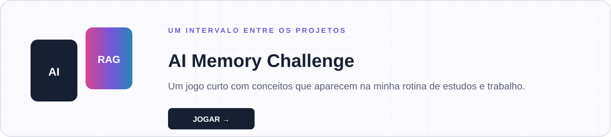

 

## Oi, eu sou a Geovanna.

Trabalho como **Analista de Inteligência Artificial** e gosto da parte em que a tecnologia deixa de ser só uma ideia interessante e começa a resolver alguma coisa de verdade.

Sou pós-graduada em **Inteligência Artificial e Machine Learning**, formada em **Gestão da Tecnologia da Informação** e estudante de **Engenharia de Software**. No dia a dia, meu foco está em IA generativa, LLMs, RAG, automação e na construção de experiências que aproximem modelos, dados e pessoas.

Este GitHub não é uma vitrine de projetos perfeitos. É o registro do que venho construindo, testando e aprendendo — inclusive das ideias que mudaram de caminho durante o desenvolvimento.

### No que estou concentrada agora

`LLMs` · `RAG` · `Python` · `IA generativa` · `Agentes` · `Automação` · `Produtos com IA`

Quero aprofundar minha atuação em projetos de IA que tenham contexto, responsabilidade e utilidade. Por isso, muitos dos meus trabalhos começam com uma pergunta real e só depois chegam à tecnologia.

---

## Quatro projetos, quatro problemas diferentes

### 01 — Proof Before Post

**A pergunta:** como ajudar alguém a verificar melhor uma informação antes de publicá-la?

O Proof Before Post é uma plataforma bilíngue de educação midiática. Ela organiza evidências e conduz a revisão, mas mantém a decisão editorial com a pessoa usuária. Foi o projeto em que mais pensei sobre confiança, contexto e responsabilidade ao usar tecnologia.

**Next.js · React · TypeScript · Playwright**  
[Conhecer o projeto](https://proof-before-post.vercel.app/) · [Abrir o repositório](https://github.com/geovannasilva15/proof-before-post)

Desenvolvido por **Geovanna Eduarda da Silva** e **[Matheus Barcelli Marques de Lima — Matheus Marks](https://github.com/BRMARKS)**.

### 02 — ClariVoz

**A pergunta:** informação digital pode ser mais simples de acessar e compreender?

Criei o ClariVoz como uma experiência de tecnologia assistiva, reunindo leitura em voz alta, simplificação de textos e ajustes de acessibilidade. É um projeto que representa bem o que eu procuro na tecnologia: menos barreiras e mais autonomia.

**Next.js · React · TypeScript · Tailwind CSS · Web Speech API**  
[Acessar o ClariVoz](https://geovannasilva15.github.io/clarivoz/) · [Abrir o repositório](https://github.com/geovannasilva15/clarivoz)

### 03 — BeautyFlow AI

**A pergunta:** como tornar a rotina de pequenos negócios de beleza menos fragmentada?

O BeautyFlow AI reúne agenda, clientes, serviços, campanhas e informações do negócio. Nele, trabalhei a ligação entre produto, interface, API, banco de dados e funcionalidades inteligentes.

**Python · FastAPI · Streamlit · SQLModel · SQLite**  
[Abrir o repositório](https://github.com/geovannasilva15/beautyflow-ai-codex-ready)

### 04 — Neural Rose

**A pergunta:** é possível perceber um risco antes que ele afete a operação?

A Neural Rose nasceu em um hackathon e propõe uma leitura preditiva de riscos em fornecedores para apoiar decisões preventivas. Além do aprendizado técnico, ela marcou o **2º lugar no Hackathon WeHandle × PUC Campinas 2026**, conquistado por uma equipe 100% feminina.

**HTML · CSS · JavaScript · Tailwind CSS · Chart.js**  
[Abrir o repositório](https://github.com/geovannasilva15/Neural-rose)

---

## Minha base técnica

| Eu construo com | Tenho estudado e aplicado |
|---|---|
| Python, JavaScript e TypeScript | LLMs, RAG e IA generativa |
| React, Next.js, FastAPI e Streamlit | Agentes e automação de fluxos |
| Pandas, SQLite e Excel | Dados, avaliação e contexto |
| Git, GitHub, AWS e Vercel | Engenharia e entrega de produtos com IA |

Não tento separar IA de engenharia ou de produto. Para mim, uma solução precisa funcionar tecnicamente, fazer sentido para o negócio e ser compreensível para quem vai usá-la.

## Além do código

Em 2026, participei de experiências que mudaram a forma como vejo minha carreira:

- conquistei o **2º lugar no Hackathon WeHandle × PUC Campinas** com a Neural Rose;
- conquistei o **2º lugar no DevReady** com o time juninhos-comunidade;
- participei do **Google Launchpad for Women — Gen AI Leader Edition**;
- atuo também como **professora tech aos sábados**, uma parte da minha rotina que me lembra que compartilhar conhecimento também é uma forma de aprender.

---

## Uma pausa para jogar

Criei um pequeno jogo de memória com conceitos que aparecem na minha rotina em Inteligência Artificial. As cartas são simples; o desafio é encontrar os pares no menor número de movimentos.

**[Jogar AI Memory Challenge →](https://geovannasilva15.github.io/portfolio-geovanna-github/game/)**

---

Se algum projeto daqui conversar com uma ideia sua, pode me chamar no [LinkedIn](https://www.linkedin.com/in/geovanna-silva-55744022a) ou por [e-mail](mailto:geovanna.eduarda2003@gmail.com).

