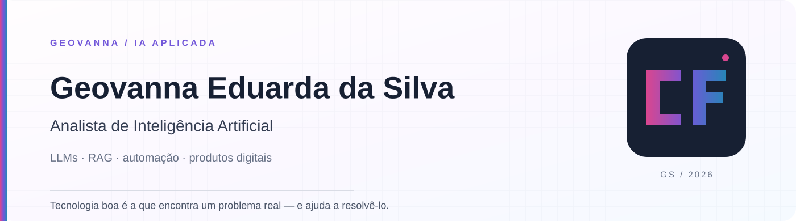

 

## Sobre mim

Sou **Geovanna Eduarda da Silva**, profissional de tecnologia com formação concluída em **Gestão da Tecnologia da Informação** e estudos em **Engenharia de Software**. Desenvolvo soluções que conectam software, inteligência artificial, dados, acessibilidade e experiência do usuário.

Tenho interesse em criar produtos digitais que solucionem problemas reais, ampliem possibilidades e gerem impacto positivo. Valorizo código organizado, experiências intuitivas e documentação que torne cada projeto fácil de compreender.

## Áreas de atuação

| Área | Como aplico |
|---|---|
| **Engenharia de Software** | Planejamento, desenvolvimento e evolução de soluções digitais estruturadas. |
| **Inteligência Artificial** | Aplicação de recursos inteligentes em produtos, automações e análise de informações. |
| **Desenvolvimento Web** | Construção de interfaces responsivas, APIs e experiências completas para a web. |
| **Produtos Digitais e Acessibilidade** | Criação de soluções centradas em pessoas, autonomia e impacto social. |

## Projetos em destaque

### Proof Before Post

Plataforma bilíngue de educação midiática que ajuda criadores de conteúdo a revisar evidências antes da publicação, mantendo a decisão editorial sob controle humano.

**Tecnologias:** Next.js, React, TypeScript e Playwright.

**Autoria:** Geovanna Eduarda da Silva e [Matheus Barcelli Marques de Lima — Matheus Marks](https://github.com/BRMARKS).

---

### ClariVoz

Tecnologia assistiva criada para facilitar o acesso à informação por meio de leitura em voz alta, simplificação de textos e recursos de acessibilidade.

**Tecnologias:** Next.js, React, TypeScript, Tailwind CSS e Web Speech API.

---

### BeautyFlow AI

Plataforma de gestão para negócios de beleza, estética e bem-estar, reunindo agenda, clientes, serviços, campanhas, dashboard e atendimento inteligente.

**Tecnologias:** Python, FastAPI, Streamlit, SQLModel e SQLite.

---

### Neural Rose

Plataforma de análise preditiva criada para identificar riscos em fornecedores antes que eles impactem a operação.

**Tecnologias:** HTML, CSS, JavaScript, Tailwind CSS e Chart.js.

**Destaque:** 2º lugar no Hackathon WeHandle × PUC Campinas 2026.

## Tecnologias

<table>
<tr>
<td width="33%" valign="top">

**Linguagens**

 Python  
 JavaScript  
 TypeScript  
 HTML  
 CSS  

</td>
<td width="33%" valign="top">

**Frameworks e bibliotecas**

 React  
 Next.js  
 FastAPI  
 Pandas  
Streamlit  

</td>
<td width="33%" valign="top">

**Dados, cloud e ferramentas**

 SQLite  
 AWS  
 Git  
 GitHub  
 Vercel  
Microsoft Excel  

</td>
</tr>
</table>

## Formação e desenvolvimento

- **Gestão da Tecnologia da Informação:** formação concluída.
- **Engenharia de Software:** estudos em andamento.
- Desenvolvimento contínuo em inteligência artificial, desenvolvimento web, dados e cloud computing.

## Estatísticas do GitHub

## Explore um pouco mais

Além dos projetos, preparei um pequeno desafio de memória com tecnologias que fazem parte da minha jornada.

---

**Tecnologia com propósito, organização e impacto positivo.**

